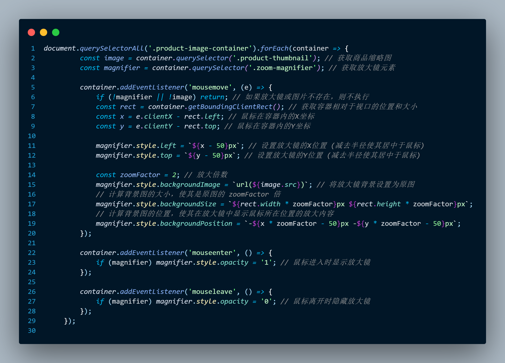

# E-commerce Mall Web Project

This is a front-end web demo inspired by JD.com (Jingdong Mall), developed as part of a training project. The site simulates a modern e-commerce platform with essential features including:

## 🔧 Features

- 🖼️ Responsive product cards with zoom effect
- 🛒 Shopping cart functionality (add/remove/clear)
- 👤 Login and registration modal with validation
- 🎨 Theme switching (Cyberpunk, COD, GTA, etc.)
- ⏱️ Flash sale countdown timer
- 📱 Mobile-responsive navigation

## 🛠️ Tech Stack

- HTML5
- CSS3 (with custom themes and animations)
- Vanilla JavaScript (no frameworks)
- LocalStorage (to store theme preferences)

## 📚 Learning Highlights

- DOM manipulation and event handling
- Form validation with regular expressions
- Modular JS functions and event delegation
- UI/UX design for e-commerce interface

## 📌 Future Improvements

- Add backend with user login/session management
- Store cart data persistently
- Product filtering and sorting
- Full mobile support and performance optimization

## 📸 Screenshots

### 🏠 Homepage

### 🛒 Servece Chat Function

### 🔐 Login / Register Modal

### 🎨 Code

Built with 💻, styled with ❤️.
